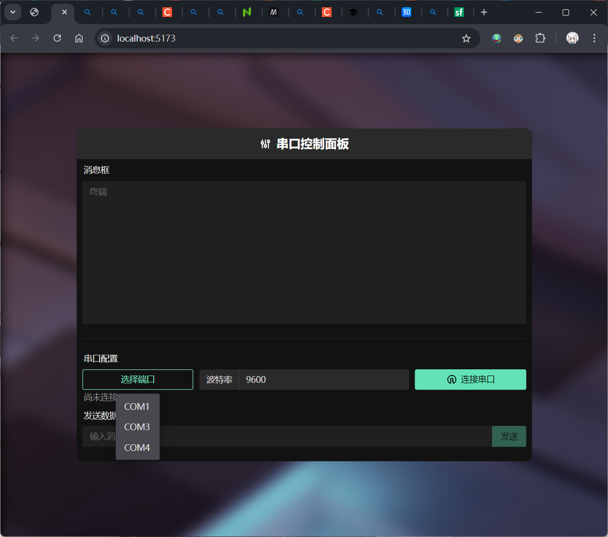
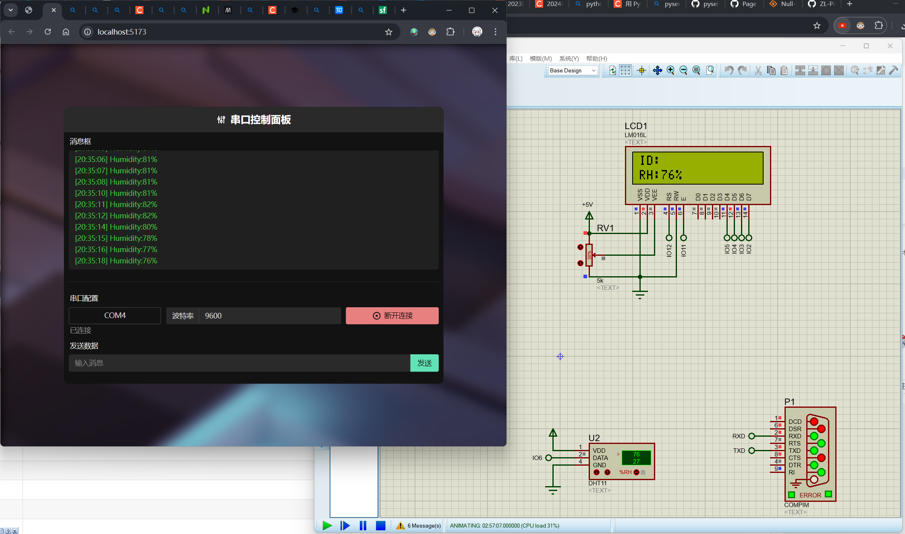
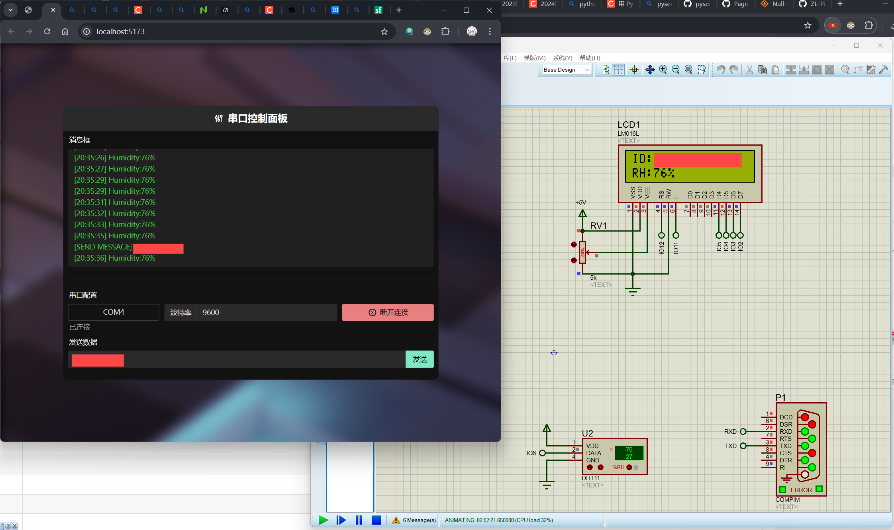
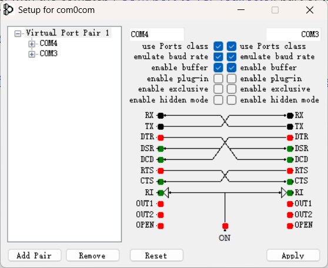

# 西电 A 测 2024 | Vue3+TS+Flask 实现

## 关于

这是一个使用独特而现代化的方式来完成西电 A 测的方式，如果你不想写 `tk/qt/pyqt/.net`，那就尝试一下本项目吧！

## 截图







## 所需环境

* Node.js
* Python
* com0com
* 与其他实现相同的仿真软件

## 参考资料

本项目使用的 `Python pySerial` 库无法正常读取 VSPD 创建的虚拟 COM，因此使用开源的 com0com 替代

> https://com0com.sourceforge.net/

2023西电A测：湿度测控仿真系统

> https://blog.csdn.net/weixin_58243145/article/details/133042452

2024西电A测：湿度监测仿真系统

> https://blog.csdn.net/m0_61230957/article/details/142708845

虚拟串口 VSPD 的使用

> https://blog.csdn.net/qq_17351161/article/details/89607458

Proteus8.9 下载与安装教程

> https://blog.csdn.net/weixin_44543463/article/details/116203188

## 使用方式

### 1. Clone 本项目

这个应该不用教了。

### 2. 安装 Node.js

去 [这里](https://nodejs.org/zh-cn) 下载最新版 Node.js 安装包，无脑下一步即可，安装玩之后检查下有没有 `npm` 命令。

### 3. 安装 Python

这个理论上也不用教了，`3.12` 版本是可以用的。

### 4. 安装依赖

去本项目的 `/Code/ControlSystem/cs-frontend` 目录下运行

```shell
npm i
# 或者
npm install
```

就可以安装上所有包，如果装不上的话可能是网络问题，运行下面的命令换个源就行

```shell
npm config set registry https://registry.npmmirror.com
```

对于 Python，使用pip安装包的命令如下：

```shell
pip install flask, flask_cors, pyserial
```

### 5. 按照教程安装其他仿真软件并且配置环境

根据 [2023西电A测：湿度测控仿真系统](https://blog.csdn.net/weixin_58243145/article/details/133042452) 以及 [2024西电A测：湿度监测仿真系统](https://blog.csdn.net/m0_61230957/article/details/142708845) 这两个教程的描述，安装并配置好 `Proteus 8.9` `Arduino IDE` `DHT-11` `XCOM`。

> 本项目不用安装 VSPD，但是如果你想留一个 VSPD 截图，可以装上截个图再删掉创建的虚拟 COM。

安装 [com0com](https://com0com.sourceforge.net/)，用于替代 VSPD 的功能。

com0com 按照下图配置参数（勾四个勾，然后删掉俩自带的）：



### 6. 运行项目并测试

```shell
# 在 ./Code/ControlSystem 目录下执行
python ./app.py

# 在 ./Code/ControlSystem/cs-frontend 目录下执行
npm run dev
```

即可启动项目。

完。

Author: Zeki Luan